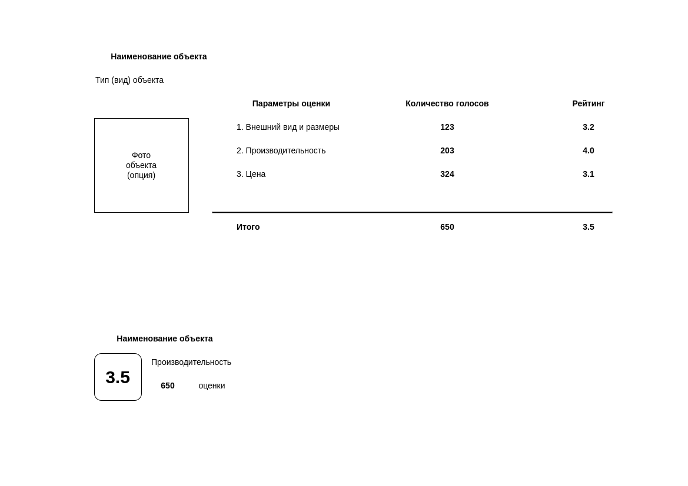

# Модель поведения покупателей и продавцов

С начала 2020 года у потребителей существенно изменились подходы к приобретению товаров, услуг и даже способы принятия
решений о покупке, в частности, люди используют цифровые сервисы и приложения на 30% больше, чем до пандемии, а одним
из важных факторов, влияющих на покупку - наличие отзыва и оценка сервиса / продукта другими клиентами.

Электронный бизнес принципиально состоит из поставщиков товаров / услуг и потребителей этих товаров / услуг, независимо
от отрасли / сферы бизнеса и области жизнедеятельности.

Рейтинг товара / услуги помогает не только его продвижению в поиске магазина (маркетплейса) / конверсии продаж.
Он также может подсказать поставщику, что требуется улучшить, какие функции обновить, сравнить свой продукт с
конкурентами, получить обратную связь и понять, как увеличить количество покупок / обращений.

На среднюю оценку продукта / сервиса перед принятием решения смотрят две трети клиентов.

Рейтинг обозначается в виде от одной до пяти звездочек, которые показываются рядом с иконкой или под названием продукта.
Чем выше будет рейтинг — тем больше доверия будет вызывать товар у клиентов, которые нашли его по ключевым словам.
Товар с рейтингом 3 звезды теряет половину потенциальных покупок, товар с 1-2 звездами — практически все возможные.

Пользовательские оценки и комментарии к приложению играют большую роль, но также важно количество оценок: лучше собрать
много средних оценок, чем всего несколько отличных. Оценки классифицируются примерно так: 5 звезд — всё отлично,
4 — нормально, 3 — оставляет желать лучшего, 2 — плохо, 1 — очень все плохо. Конечно, для высокого рейтинга необходимо,
чтобы оценки 5 и 4 превалировали над остальными, но наличие негативных отзывов тоже важно: они избавляют от сомнений,
что оценки выставлены ботами и указывают на реальные недостатки продукта / сервиса.

## Визуальная схема фронтенда, описание MVP
