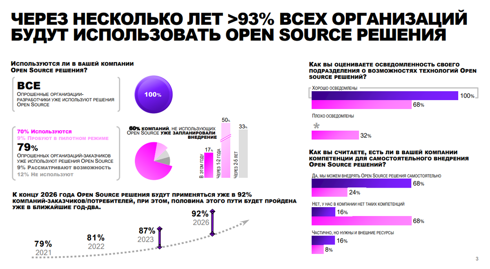
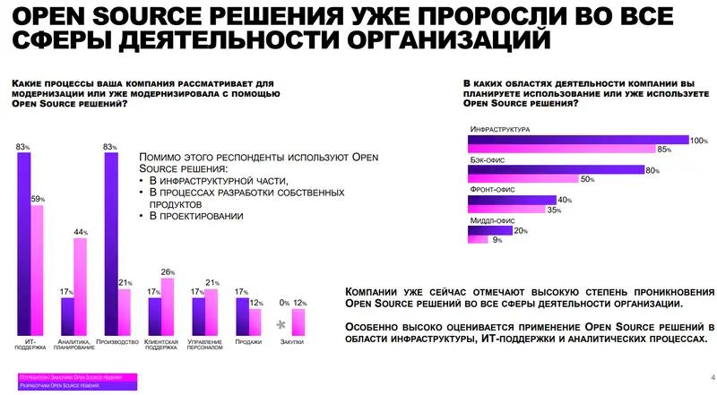

# Экономический анализ

По данным исследования, проведенного компанией Accenture при поддержке Фонда «Сколково» (в координации с ВЭБ.РФ),
программное обеспечение с открытым кодом уже в 2026 году будут применять более 90% компаний в РФ.

Чаще всего компании рассматривают для модернизации с помощью Open Source следующие процессы:
- ИТ-поддержка (83% компаний-разработчиков и 59% потребителей),
- аналитика и планирование (соответственно, 17% и 44%),
- производство (83% и 21%),
- клиентская поддержка (17% и 26%),
- управление персоналом (17% и 21%),
- продажи (17% и 12%).

Более 50% респондентов дорабатывают готовые решения, а еще треть предпочитает разработку собственных.

Отмечается высокий потенциал роста для российских решений Open Source. Выделено десять ключевых категорий, по которым
провели детальный анализ использования Open Source, в том числе: сервисы для сотрудников, корпоративные сервисы,
интеграция/службы очередей, сервисы Web-приложений, инструменты разработки и другие направления.

В исследуемых категориях в группе респондентов-потребителей только 4% используют Open Source решения отечественных
разработчиков против 19% глобальных Open Source разработок и проприетарного ПО. Среди компаний-разработчиков уже 10%
работают с отечественными решениями, однако 42% приходится на блок глобальных Open Source разработок и проприетарного ПО.
При этом сводная оценка соответствия ИТ-продуктов требованиям компаний составляет 3,8 балла из 5, а среднее покрытие
необходимых функций ИТ-продуктами — лишь 62%.

Отдельно проанализированы сложности, с которыми сталкиваются российские корпорации при внедрении технологий Open Source.
Общими для всех типов компаний проблемами при взаимодействии с решениями Open Source являются необходимость в адаптации
под конкретный процесс (с этим сталкивается 80% респондентов-разработчиков и более 40% потребителей) и сложности в
интеграции со смежными системами (60% разработчиков и потребителей).

[Ссылка](https://sk.ru/news/accenture/)

## Объем рынка в целом

Анализ ситуации показал, что зона потенциального роста использования Open Source-продуктов российской разработки 
составляет 19% рынка в сегменте компаний-пользователей и 42% – в сегменте компаний-разработчиков. 
Так, из компаний-пользователей открытым софтом российской разработки пользуются 4% респондентов, 9% полагаются на 
зарубежное открытое ПО, а еще 10% используют проприетарный софт. Для сегмента респондентов-разработчиков аналогичные 
показатели составляют 10%, 27% и 15% соответственно.

Рынок Open Source-софта в России предоставляет пространство для ощутимого роста по множеству направлений.

[Ссылка](https://www.iksmedia.ru/news/5865502-Open-Source-v-Rossii-budut-ispolzov.html)